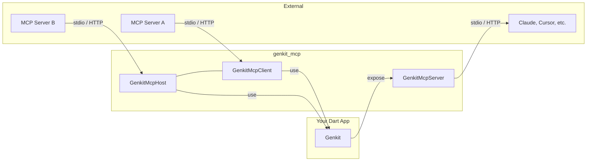

[](https://pub.dev/packages/genkit_mcp)

**MCP (Model Context Protocol) integration for Genkit Dart**

Expose Genkit tools, prompts, and resources as an MCP server, or connect to external MCP servers as a client — all with a unified API.

[Documentation](https://genkit.dev) • [API Reference](https://pub.dev/packages/genkit_mcp) • [MCP Specification](https://modelcontextprotocol.io)

---

## Installation

```bash
dart pub add genkit_mcp
```

## Overview

`genkit_mcp` provides three main components:

- **MCP Server** — Expose your Genkit actions (tools, prompts, resources) over the MCP protocol.
- **MCP Client** — Connect to a remote MCP server and use its tools, prompts, and resources.
- **MCP Host** — Manage multiple MCP server connections and aggregate their capabilities.



### Supported MCP Features (High-level)

- **As an MCP server** (`GenkitMcpServer`)
  - Tools, prompts, resources, and resource templates
  - List-change and resource-update subscriptions
  - Completions (`completion/complete`)
  - Request-scoped logging in MCP 2026-07-28
  - Legacy logging (`logging/setLevel`), tasks (`tasks/*`), and progress notifications
- **As an MCP client** (`GenkitMcpClient` / `GenkitMcpHost`)
  - Connect over stdio or Streamable HTTP
  - Discover and call tools, prompts, and resources from remote servers
  - Handle server-initiated requests for roots (`roots/list`)
  - Optional handlers for sampling (`sampling/createMessage`) and elicitation (`elicitation/create`)
  - Task lifecycle support for long-running inbound requests (client-side `tasks/*`)

### Supported Transports

- **Stdio** — Standard input/output (for CLI tools and subprocess-based servers)
- **Streamable HTTP** — HTTP with Server-Sent Events (for web-based deployments)

---

## MCP Host

To connect to one or more MCP servers (the recommended approach), use the `defineMcpHost` function. This returns a `GenkitMcpHost` instance that manages connections to the configured MCP servers and automatically registers their tools, prompts, and resources as Genkit actions.

```dart
import 'package:genkit/genkit.dart';
import 'package:genkit_mcp/genkit_mcp.dart';

void main() async {
  final ai = Genkit();

  // Each key (e.g., 'fs', 'memory') becomes a namespace for the server's tools.
  final host = defineMcpHost(
    ai,
    McpHostOptionsWithCache(
      name: 'my-host',
      mcpServers: {
        'fs': McpServerConfig(
          command: 'npx',
          args: ['-y', '@modelcontextprotocol/server-filesystem', '.'],
        ),
        'memory': McpServerConfig(
          command: 'npx',
          args: ['-y', '@modelcontextprotocol/server-memory'],
        ),
      },
    ),
  );

  // Tools can be discovered and executed dynamically using a wildcard...
  final response = await ai.generate(
    model: 'gemini-flash-latest',
    prompt: 'Summarize the contents of README.md',
    toolNames: ['my-host:tool/fs/*'],
  );

  // ...or by specifying the exact tool name
  final exactResponse = await ai.generate(
    model: 'gemini-flash-latest',
    prompt: 'Read README.md',
    toolNames: ['my-host:tool/fs/read_file'],
  );

  print(response.text);
}
```

### `McpHostOptionsWithCache` Options

- **`name`**: (required) A name for the MCP host instance.
- **`cacheTtlMillis`**: (optional) Cache TTL in milliseconds for tool/prompt/resource listings. A positive value overrides server hints, a negative value disables caching, and `null` or `0` uses the MCP 2026-07-28 server `ttlMs` hint when available, otherwise falling back to 3 seconds.
- **`version`**: (optional) Version string for this host.
- **`mcpServers`**: (optional) A map where each key is a namespace for an MCP server, and the value is its `McpServerConfig`.
- **`rawToolResponses`**: (optional) When `true`, tool responses are returned in their raw MCP format.
- **`roots`**: (optional) Roots to advertise to servers that request `roots/list`.

---

## MCP Client (Single Server)

Connecting to a single MCP server with a client object is an advanced use case for when you need manual control over the client lifecycle or want to avoid automatic registry integration. To connect to a single MCP server, use `createMcpClient`.

Because a standalone client does not automatically register its tools with the Genkit registry, you must fetch the active tools and provide them directly to the `ai.generate` function in order to use them.

```dart
import 'package:genkit/genkit.dart';
import 'package:genkit_mcp/genkit_mcp.dart';

void main() async {
  final ai = Genkit();

  final client = createMcpClient(
    McpClientOptions(
      name: 'my-client',
      mcpServer: McpServerConfig(
        command: 'npx',
        args: ['-y', '@modelcontextprotocol/server-filesystem', '.'],
      ),
    ),
  );

  await client.ready();

  // Retrieve the tools from the connected client
  final tools = await client.getActiveTools(ai);
  
  final response = await ai.generate(
    model: 'gemini-flash-latest',
    prompt: 'Read the contents of README.md',
    // Pass the tools directly to generate
    tools: tools,
  );

  print(response.text);
}
```

### `McpClientOptions`

- **`name`**: (required) A unique name for this client instance.
- **`serverName`**: (optional) Overrides the name used when prefixing tools, prompts, and resources returned by `getActiveTools()`, `getActivePrompts()`, and `getActiveResources()`.
- **`version`**: (optional) Version string for this client.
- **`rawToolResponses`**: (optional) When `true`, tool responses are returned in their raw MCP format. Defaults to `false`.
- **`mcpServer`**: (required) A `McpServerConfig` with one of the following:
  - **`command`** + **`args`**: Launch a local server process via stdio transport.
  - **`url`**: Connect to a remote server via Streamable HTTP transport.
  - **`transport`**: Provide a custom `McpClientTransport` instance.
- **`samplingHandler`**: (optional) Handler for server-initiated sampling requests.
- **`elicitationHandler`**: (optional) Handler for server-initiated elicitation requests.
- **`notificationHandler`**: (optional) Handler for server notifications.
- **`cacheTtlMillis`**: (optional) Cache TTL in milliseconds for remote actions. A positive value overrides server hints, a negative value disables caching, and `null` or `0` uses the MCP 2026-07-28 server `ttlMs` hint when available, otherwise falling back to 3 seconds.

---

## MCP Server

Expose all tools, prompts, and resources from a Genkit instance as an MCP server.

```dart
import 'package:genkit/genkit.dart';
import 'package:genkit_mcp/genkit_mcp.dart';
import 'package:schemantic/schemantic.dart';

void main() async {
  final ai = Genkit();

  ai.defineTool(
    name: 'add',
    description: 'Add two numbers together',
    inputSchema: .map(.string(), .dynamicSchema()),
    fn: (input, _) async {
      final a = num.parse(input['a'].toString());
      final b = num.parse(input['b'].toString());
      return .response((a + b).toString());
    },
  );

  ai.defineResource(
    name: 'my-resource',
    uri: 'my://resource',
    fn: (_, _) async {
      return ResourceOutput(content: [TextPart(text: 'my resource')]);
    },
  );

  ai.defineResource(
    name: 'file',
    template: 'file://{path}',
    fn: (input, _) async {
      return ResourceOutput(
        content: [TextPart(text: 'file contents for ${input.uri}')],
      );
    },
  );

  // Create and start the MCP server (stdio transport by default).
  final server = createMcpServer(ai, McpServerOptions(name: 'my-server'));
  await server.start();
}
```

MCP tool input schemas must have an object root. MCP 2026-07-28 clients receive
arbitrary JSON output schemas and structured results, including arrays, scalar
values, and explicit `null`. For MCP 2025-11-25 compatibility, non-object
output schemas are omitted and non-object results remain available through text
content.

### Streamable HTTP Transport

```dart
import 'dart:io';

final transport = await StreamableHttpServerTransport.bind(
  address: InternetAddress.loopbackIPv4,
  port: 3000,
);
await server.start(transport);
// Server is now available at http://localhost:3000/mcp
```

Each `StreamableHttpServerTransport` instance owns one MCP protocol connection.
Use a fresh transport/server lifecycle for an independent client.

DNS rebinding protection and JSON-RPC batch rejection are enabled by default.
Loopback hosts (`localhost`, `127.0.0.1`, and `::1`) work without additional
configuration. A non-loopback deployment must supply `allowedHosts` and should
supply `allowedOrigins`. Set `rejectBatchJsonRpcPayloads: false` only when a
legacy client explicitly requires JSON-RPC batches.

### `McpServerOptions`

- **`name`**: (required) The name your server will advertise to MCP clients.
- **`version`**: (optional) The version your server will advertise. Defaults to `"1.0.0"`.

---

## Namespacing

Actions can be namespaced to avoid conflicts (behavior depends on whether you use a host or a single client):

- **`defineMcpHost` / `GenkitMcpHost`**: Actions are exposed as `hostName/serverKey:actionName` (e.g., `my-host/fs:read_file`).
- **`GenkitMcpClient.getActiveTools()` / `getActivePrompts()` / `getActiveResources()`**: Actions are named `client.serverName/actionName`.
  - `client.serverName` defaults to the remote server's `initialize.serverInfo.name` (if provided), otherwise `McpClientOptions.serverName`, otherwise `McpClientOptions.name`.
  - Set `McpClientOptions.serverName` if you want a stable prefix independent of the remote server's self-reported name.

---

## Tool Responses

MCP tools return a `content` array and can also return `structuredContent`. The
plugin processes results in this order:

1. If the result contains `isError: true`, the processed value is returned as `{'error': '<text>'}`.
2. If `structuredContent` is present, its JSON value is returned directly, including an explicit `null`.
3. If **all** `content` parts are text, they are concatenated into a single string.
   - If the concatenated text *looks like JSON* (starts with `{` or `[` after left-trimming), the client tries `jsonDecode(...)` and returns the decoded object/list on success.
   - Otherwise the concatenated text is returned as a `String`.
4. If `content` has exactly one **non-text** part, that part map is returned (e.g. an image/audio block).
5. If `content` has multiple or mixed parts, the raw MCP result map is returned.

Set `rawToolResponses: true` in client options to skip this processing and receive raw MCP responses.

---

## Known Limitations

- MCP prompts only accept **string (and nullable string) parameters**, so prompt input schemas must be objects with only string (or null) property values.
- MCP prompt message roles only support **`user`** and **`assistant`** (Genkit `Role.user` / `Role.model`). `system` is not supported.
- Media in prompts/resources must be provided as **base64 data URLs** (`data:<mimeType>;base64,<data>`). HTTP/HTTPS URLs are rejected.
- Resource templates only support **simple `{var}`** substitutions (no URI-template operators like `{+path}`).

---

## Testing Your MCP Server

You can test your MCP server using the official [MCP Inspector](https://github.com/modelcontextprotocol/inspector).

### Stdio server

If your server uses the stdio transport (the default), launch the inspector with the command and arguments separated:

```bash
# During development (replace with your entrypoint)
npx @modelcontextprotocol/inspector dart run bin/server.dart

# With a compiled binary
npx @modelcontextprotocol/inspector ./my_mcp_server
```

> **Note:** The MCP Inspector is a Node.js tool. You need `npx` (from Node.js) installed to use it. It launches your Dart server as a subprocess and communicates via stdio.

### Streamable HTTP server

If your server uses the Streamable HTTP transport, start your server first, then connect the inspector to its URL:

```bash
# Start your server (replace with your entrypoint)
dart run bin/server.dart

# In another terminal, open the inspector and connect to the URL
npx @modelcontextprotocol/inspector
# Then enter the server URL (e.g., http://localhost:3000/mcp) in the inspector UI.
```

Once the inspector is connected, you can list tools, prompts, and resources, and test them interactively.

---

## Protocol Version

This package supports MCP **2026-07-28** and retains compatibility with
initialization-based MCP **2025-11-25** servers and clients.

Protocol validation, negotiation, and transport handling are backed by
`mcp_dart` 2.3. Clients prefer the stateless 2026-07-28 protocol through
`server/discover` and automatically fall back to the 2025-11-25 initialization
lifecycle when discovery is unavailable. Streamable HTTP preserves the
protocol-version and method headers required by the latest specification.
To connect over Streamable HTTP, configure `McpServerConfig(url: ...)`.

In MCP 2026-07-28, list-change and resource-update notifications use
`subscriptions/listen`, and log levels are carried in request metadata. The
public `GenkitMcpClient` APIs adapt these automatically. The legacy
`resources/subscribe`, `resources/unsubscribe`, `logging/setLevel`, and
`tasks/*` methods remain available when a 2025-11-25 connection is negotiated.
Latest-protocol action listings also honor the server's `ttlMs` cache hint.
A positive `cacheTtlMillis` overrides that hint, a negative value disables
caching, and `null` or `0` uses the hint with a 3-second fallback when it is
absent.

---

Built by [Google](https://firebase.google.com/) with contributions from the [Open Source Community](https://github.com/genkit-ai/genkit-dart/graphs/contributors).
